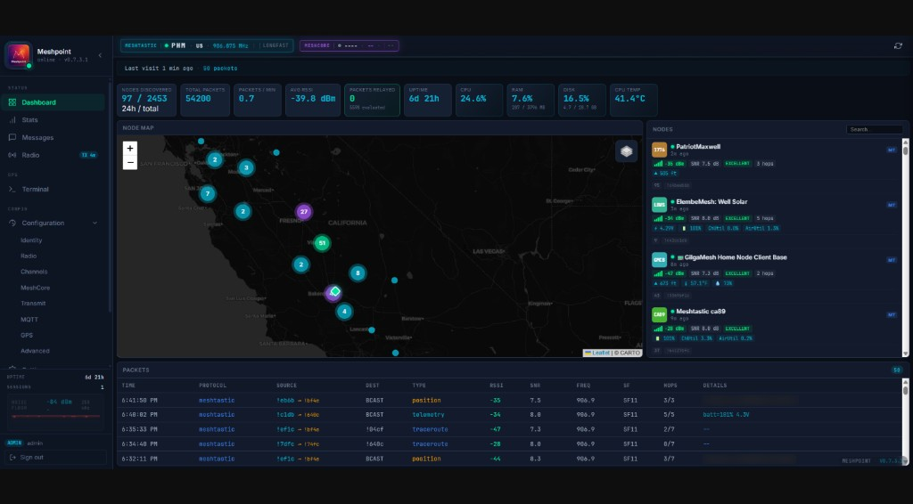

<p align="center">
  
</p>

<h1 align="center">Meshpoint</h1>

<p align="center"><strong>Open-source Meshtastic base station with native TX/RX, 8-channel concentrator, and browser-based messaging.</strong><br>Runs on Raspberry Pi 4 + SX1302/SX1303. Supports US915, EU868, ANZ915, IN865, KR920, and SG923.</p>

[](LICENSE)
[](https://www.python.org/)
[](https://www.raspberrypi.com/)
[](https://discord.gg/BnhSeFXVY8)
[](https://github.com/KMX415/meshpoint/stargazers)
[](https://github.com/KMX415/meshpoint/issues)
[](https://github.com/KMX415/meshpoint/commits/main)
[](docs/CHANGELOG.md)

### Meshradar Cloud Dashboard


### Local Dashboard


### Messaging


### Startup Log


---

## What Is This?

A Raspberry Pi-based Meshtastic base station that sends and receives messages through an SX1302/SX1303 concentrator. The concentrator receives on 8 channels simultaneously (SF7-SF12) and transmits natively with up to 27 dBm output. Phones and nodes see it as a regular participant on the mesh.

Everything is managed from a browser dashboard: full chat with channels and DMs, node discovery, radio configuration, and live packet feed. Also supports MeshCore traffic through a USB companion. Optionally syncs upstream to [Meshradar](https://meshradar.io) for aggregated multi-site mesh intelligence.

### Standard Node vs Meshpoint

| | Standard Node | Meshpoint |
|---|---|---|
| **Radio** | Single transceiver | SX1302 concentrator (RX + TX) |
| **Role** | Participant | Observer + participant |
| **Packet visibility** | Own traffic | Everything in range |
| **Messaging** | Phone app only | Full chat from any browser |
| **Storage** | None | SQLite with retention |
| **Dashboard** | None | Real-time web UI with radio config |

---

## Features

**Native mesh messaging.** Send and receive Meshtastic messages directly from the dashboard. Broadcast to channels, DM individual nodes, or reply in conversations. MeshCore messaging supported through the USB companion. The SX1302 handles TX using the same sync word and encryption as the mesh network: phones and nodes see your Meshpoint as a regular participant.

**Smart relay (experimental).** Re-broadcast captured Meshtastic packets through the same onboard SX1302, identity-preserving — original sender attribution and packet IDs survive, only the hop counter decrements. No second radio required. Filter by signal strength, packet type, and rate limit; share duty-cycle budget with messaging so relay traffic can never crowd out user TX. Enable via `relay.enabled: true` in `local.yaml`. See [Configuration > Smart Relay](docs/CONFIGURATION.md#smart-relay) for details and the v0.7.4 test checklist for validation steps.

**Full chat UI.** Conversations organized by channel and contact. Signal info (SNR, RSSI) on every received bubble. Duplicate badge shows how many times a relayed message was heard. Channel sidebar with LongFast, custom channels, and DM contacts. Message history persisted in SQLite.

**Radio configuration from the dashboard.** Change region, modem preset, frequency, TX power, and duty cycle without SSH. Add and remove channels with custom PSKs. Toggle TX enable/disable. All settings saved to `local.yaml` and survive restarts.

**Node discovery.** Live node cards showing every node your Meshpoint has heard: name, ID, protocol, hardware model, signal strength, battery, and last seen. Click any node to open a detail drawer with signal history and direct message.

**Dual-protocol capture.** Meshtastic and MeshCore traffic captured simultaneously. The SX1302 concentrator handles Meshtastic, while a USB MeshCore companion covers MeshCore on its own frequency.

**Full packet decoding.** 14 Meshtastic portnums decoded: TEXT, POSITION, NODEINFO, TELEMETRY, ROUTING, ADMIN, WAYPOINT, DETECTION_SENSOR, PAXCOUNTER, STORE_FORWARD, RANGE_TEST, TRACEROUTE, NEIGHBORINFO, and MAP_REPORT. 6 MeshCore message types decoded. Device roles (CLIENT, ROUTER, REPEATER, TRACKER, SENSOR) extracted from NodeInfo.

**Multi-channel decryption.** Configure private channel PSKs from the dashboard or `local.yaml`. The Meshpoint decodes traffic on those channels alongside the default key and routes messages to the correct conversation. Supports any number of channels with AES-128 or AES-256 keys.

**6 frequency regions.** US, EU_868, ANZ, IN, KR, and SG_923. Select during setup or change from the Radio settings page. MeshCore companion radios configure to match automatically.

**Real-time dashboard.** Live map with node positions, color-coded packet feed with frequency and spreading factor columns, traffic charts, signal analytics, and node cards. Accessible from any device on your network.

**GPS and split placement.** USB GPS via `gpsd` drives the Configuration → GPS skyplot. Registered coordinates (wizard pin) always feed [Meshradar](https://meshradar.io) fleet view. Meshtastic POSITION broadcasts on the LoRa mesh are separately configurable: registered pin or live GPS, with approximate (~1.1 km), precise, or hidden privacy on live. See [Configuration > Location](docs/CONFIGURATION.md#location-gps-source).

**Cloud integration.** Optional WebSocket uplink to [Meshradar](https://meshradar.io) for aggregated multi-site mesh intelligence. Fleet management, city-wide maps, and packet history across all your Meshpoints.

**Dual-protocol MQTT gateway.** Publish captured packets to community MQTT brokers and Home Assistant. Dual-protocol: Meshtastic (protobuf) and MeshCore (JSON) from a single device. Two-gate privacy model ensures private channel data never leaks. Optional JSON publishing, HA auto-discovery, and configurable location precision.

**Auto-detect hardware.** RAK Hotspot V2, SenseCap M1, and Syncrobit Chameleon (SX1302) supported; carrier board may show as generic SX1302/Pi during setup. MeshCore USB companions auto-detected on `/dev/ttyUSB*` and `/dev/ttyACM*`.

---

## Hardware

> **Requirements:** Raspberry Pi 4 or Compute Module 4, **64-bit** Raspberry Pi OS or Raspbian Lite, Python 3.12+. Pi 3, Pi 5 (unvalidated), x86, and 32-bit OS are not supported.

### Option A: RAK Hotspot V2 (~$60, recommended)

The easiest path. RAK/MNTD Hotspot V2 miners (model **RAK7248**) include a Pi 4, RAK2287 (SX1302), Pi HAT, metal enclosure, antenna, and power supply: everything you need. Helium's IoT network didn't pan out, so these are all over eBay for $40-70.

[Find on eBay ($30-80)](https://www.ebay.com/sch/i.html?_nkw=RAK%20Hotspot%20V2%20%2F%20MNTD&_sacat=0&_from=R40&rt=nc&_udlo=30&_udhi=80)


Remove the black tape covering the SD card slot and carefully remove SD. Flash a new card with Raspberry Pi OS 64-bit, run the install script, and you have a Meshpoint in a nice aluminum enclosure.

### Option B: SenseCap M1 (~$40-60)

Another Helium-era miner with identical compatibility. The SenseCap M1 includes a Pi 4, Seeed WM1303 concentrator (SX1303), carrier board, metal enclosure, and antenna. Some units ship with a 64GB SD card included.

[Find on eBay ($30-60)](https://www.ebay.com/sch/i.html?_nkw=SenseCap%20M1&_sacat=0&_from=R40&rt=nc&_udlo=30&_udhi=60)


Remove the 2 screws on the back panel (the side without the Ethernet/antenna ports) to access the SD card: it may be held in place by kapton tape. Flash with Raspberry Pi OS 64-bit and run the install script. USB-C power connects to the carrier board, not the Pi directly.

### Option C: Syncrobit Chameleon (CM4 eMMC, SX1302)

Retired **Syncrobit Chameleon** LoRa miners bundle a **Compute Module 4** (onboard
eMMC), an **SX1302** concentrator, enclosure, and antenna. Many units support
**PoE**. There is no microSD slot: you flash **64-bit** Raspberry Pi OS or
Raspbian Lite to eMMC once over USB using a CM4 carrier board (for example
Waveshare CM4-IO-BASE-B) and Raspberry Pi `usbboot`, then run the same
`install.sh` + `meshpoint setup` flow as a RAK V2.

Meshpoint replaces the original Chameleon firmware. Community-validated on
aarch64 Raspbian 13 (Trixie) with live Meshtastic RX/TX.

> **Step-by-step:** [Syncrobit Chameleon guide](docs/SYNCROBIT-CHAMELEON.md) and [Hardware Matrix](docs/HARDWARE-MATRIX.md).

### Option D: Build Your Own (~$85)

| Component | Price |
|-----------|-------|
| Raspberry Pi 4 (1GB+) | $35 |
| RAK2287 SX1302 + Pi HAT | ~$20* |
| 915 MHz LoRa antenna | $10 |
| MicroSD card (16GB+) | $10 |
| USB-C power supply (5V 3A) | $10 |

*\*Helium's surplus means RAK2287 concentrators and Pi HATs go for ~$20 combined on eBay.*

**Assembly:** Seat the RAK2287 on the Pi HAT, mount the HAT on the Pi GPIO header, connect the antenna. Always connect the antenna before powering on.

### Optional: MeshCore USB Companion

Add a Heltec V3/V4 or T-Beam running [MeshCore USB companion firmware](https://flasher.meshcore.co.uk/) to monitor MeshCore traffic alongside Meshtastic. Plug it into any USB port on the Pi -- the setup wizard auto-detects the device and configures its radio frequency for your region.

> **Full step-by-step guide:** See the [Onboarding Guide](docs/ONBOARDING.md) for detailed instructions covering SD flashing, Chameleon eMMC recovery, assembly, installation, MeshCore setup, and troubleshooting for all hardware options.

---

## Install

```bash
sudo apt update && sudo apt install -y git
sudo git clone https://github.com/KMX415/meshpoint.git /opt/meshpoint
cd /opt/meshpoint && sudo bash scripts/install.sh
```

This builds the SX1302 HAL with Meshtastic patches, sets up a Python venv, and installs the systemd service.

```bash
sudo meshpoint setup    # interactive config wizard
meshpoint status        # verify everything is running
```

Open `http://<pi-ip>:8080` for the local dashboard. On first visit (and after upgrading from v0.7.2 or earlier) you'll be prompted to set an admin password at `/setup` (8-character minimum). After that, all dashboard access requires sign-in. If you forget the password, recover via SSH with `sudo meshpoint reset-password` -- the command prompts interactively, rotates the JWT secret, and invalidates any open browser sessions.

> **First time?** The [Onboarding Guide](docs/ONBOARDING.md) walks through everything from flashing the SD card to verifying your first captured packets.

---

## Architecture

```
                                ┌─────────────────────────┐
                                │    Meshradar Cloud       │
                                │    (meshradar.io)        │
                                └────────────┬────────────┘
                                             │ WebSocket
                                             │
┌──────────┐    ┌──────────┐    ┌────────────┴────────────┐
│Meshtastic│    │ SX1302/  │    │    Meshpoint (Pi 4)      │
│ packets  │◀──▶│ SX1303   │◀──▶│                          │
│ (OTA)    │    │ RX + TX  │    │  Capture → Decode → API  │
└──────────┘    └──────────┘    │      ▲           │       │
                                │      │       Dashboard   │
┌──────────┐    ┌──────────┐    │   Messages    (port 8080)│
│ MeshCore │    │  Heltec  │    │   + Chat UI              │
│ packets  │◀──▶│  USB     │◀──▶│                          │
│ (OTA)    │    │companion │    │                          │
└──────────┘    └──────────┘    └─────────────────────────┘
```

---

## CLI

```bash
meshpoint status         # service status + config summary
meshpoint logs           # tail the service journal
meshpoint report         # full operational report (traffic, signal, system)
meshpoint restart        # restart the service
meshpoint meshcore-radio # configure MeshCore companion radio frequency
sudo meshpoint setup     # re-run config wizard
```

---

## Local API

FastAPI server on port 8080:

| Endpoint | Description |
|----------|-------------|
| `GET /api/nodes` | All discovered nodes |
| `GET /api/nodes/map` | Nodes with GPS for map display |
| `GET /api/packets` | Recent packets (paginated) |
| `GET /api/analytics/traffic` | Traffic rates and counts |
| `GET /api/analytics/signal/rssi` | RSSI distribution |
| `GET /api/device/status` | Device health and uptime |
| `GET /api/config` | Radio, TX, and channel configuration |
| `PUT /api/config/transmit` | Update TX settings |
| `PUT /api/config/identity` | Update node ID, long/short name |
| `PUT /api/config/radio` | Change region, preset, frequency |
| `POST /api/messages/send` | Send a Meshtastic or MeshCore message |
| `GET /api/messages/conversations` | Message history by conversation |
| `WS /ws` | Real-time packet + message stream |

---

## Updating

Use this block whether you are on v0.6.x, v0.7.3, or already current. `install.sh` is idempotent on existing installs: it refreshes the venv (`pip install -r requirements.txt`), removes stale pre-v0.7.0 `.so` binaries if any remain, updates sudoers and the systemd unit, and does **not** require a reboot on upgrade.

```bash
cd /opt/meshpoint
sudo git fetch origin
sudo git checkout main
sudo git pull origin main
sudo bash scripts/install.sh
sudo systemctl restart meshpoint
```

The local dashboard shows an orange update indicator when a new version is available on GitHub. After every update, hard-refresh each open dashboard tab (Ctrl+Shift+R / Cmd+Shift+R) so the browser loads the new frontend.

**First time crossing v0.7.3:** after restart, open `http://<pi-ip>:8080` and complete `/setup` to set an admin password (8 characters minimum). Forgot it later? `sudo meshpoint reset-password` from SSH.

**Already on v0.7.3+ and update often?** `sudo git pull origin main` plus `sudo systemctl restart meshpoint` is usually enough unless the release notes call out new dependencies. When in doubt, run the full block above.

**From the dashboard (v0.7.4+):** sign in as admin, open Settings → Updates, pick **Stable (main)**, then **Check for updates** and **Apply** (same end state as the SSH block).

See [docs/COMMON-ERRORS.md](docs/COMMON-ERRORS.md#upgrades) if the service fails to start after pulling (missing `bcrypt`, stale `.so` files, spurious reboot prompt).

---

## Troubleshooting

**Chip version 0x00:** Concentrator not responding. Check that the concentrator module is seated, SPI is enabled (`raspi-config` → Interface Options → SPI), and try a full power cycle (unplug for 10+ seconds). Normal chip versions are `0x10` (SX1302) and `0x12` (SX1303).

**No packets:** Verify antenna is connected and frequency matches your region. Check `meshpoint logs` for `lgw_receive returned N packet(s)`.

**Upstream 401:** Bad API key. Get a free one at [meshradar.io](https://meshradar.io) and re-run `sudo meshpoint setup`.

---

## Support and documentation

Start with the doc that matches what you are trying to do.

**Setup and configuration**
- **[Onboarding Guide](docs/ONBOARDING.md):** step-by-step from empty Pi to running Meshpoint
- **[Hardware Matrix](docs/HARDWARE-MATRIX.md):** RAK V2 vs SenseCap M1 vs DIY, MeshCore companion radios, antennas, what's not supported
- **[Configuration Guide](docs/CONFIGURATION.md):** all config options, private channels, relay, upstream, MQTT, radio tuning
- **[Radio Config Explained](docs/RADIO-CONFIG-EXPLAINED.md):** the "why" behind region, spreading factor, bandwidth, custom slots, Part 15 awareness
- **[MQTT and Meshradar](docs/MQTT-AND-MESHRADAR.md):** the two cloud paths side-by-side, what data flows where, privacy posture
- **[Network Watchdog](docs/NETWORK-WATCHDOG.md):** how the WiFi auto-recovery service works, default thresholds, re-enabling auto-reboot

**When something goes wrong**
- **[FAQ](docs/FAQ.md):** quick answers to common questions
- **[Common Errors](docs/COMMON-ERRORS.md):** searchable catalog of error messages with cause and fix
- **[Troubleshooting](docs/TROUBLESHOOTING.md):** longer diagnostic flows, recovery from corrupted installs

**Project**
- **[Changelog](docs/CHANGELOG.md):** version history and release notes
- **[GitHub Issues](https://github.com/KMX415/meshpoint/issues)** and **[Discussions](https://github.com/KMX415/meshpoint/discussions)** for bugs and questions
- **[Discord](https://discord.gg/BnhSeFXVY8)** for real-time community support

---

## Community

- **Discord:** [discord.gg/BnhSeFXVY8](https://discord.gg/BnhSeFXVY8)
- **Website:** [meshradar.io](https://meshradar.io)
- **Issues:** [GitHub Issues](https://github.com/KMX415/meshpoint/issues)

---

## Contributing

Meshpoint is still early alpha. Pull requests are welcome, but please keep changes small and reviewable.

See [CONTRIBUTING.md](CONTRIBUTING.md) for guidelines, workflow, and PR expectations.

AI-assisted contributions are allowed, but contributors should review and understand all code before submitting.

---

## License

AGPL-3.0: see [LICENSE](LICENSE). All source code, including HAL bindings, protocol decoders, and packet builders, is published in this repository under the same license.

---

*Built for the mesh community by [Meshradar](https://meshradar.io).*
