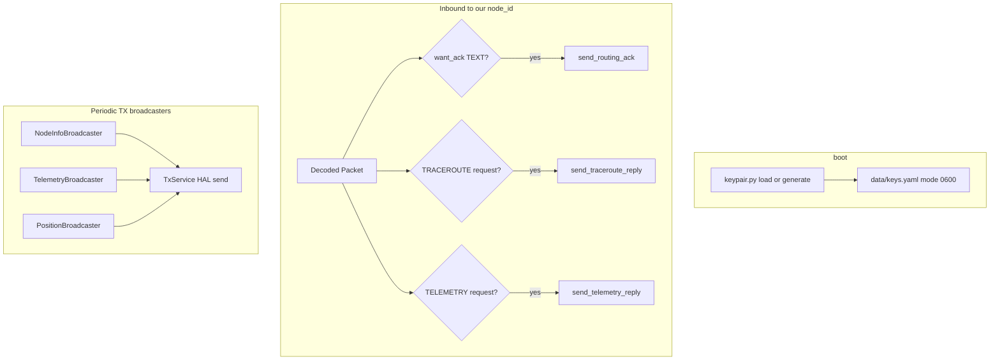

# v0.7.6 release plan (edge): Meshtastic mesh participant

**Status:** In progress on branch `feat/v0.7.6-pki`. **Vehicle:** edge release after v0.7.5 merges to `main`.

**Goal:** A Meshpoint appears and behaves like a normal Meshtastic node in phone apps and on the mesh, not just a passive gateway.

**In scope (v0.7.6):**

| Feature | Required |
|---------|----------|
| Meshtastic PKI (2.5+ DMs, green lock, `public_key` in NodeInfo) | Yes |
| DM routing ACKs | Yes |
| Periodic `device_metrics` telemetry TX | Yes |
| Position broadcasts when lat/lon configured | Yes |
| Traceroute response (direct / single-hop reply) | Yes |
| MQTT broker TLS (`mqtts`) | Yes |

**Out of scope:**

| Item | Why |
|------|-----|
| MeshCore PKI | Different protocol; USB companion handles MC crypto |
| ADMIN port responses | Remote config on a fleet gateway is a security boundary |
| NEIGHBORINFO / STORE_FORWARD TX | Meshpoint is observer/gateway, not RF router |
| SX1261 native MeshCore RX | v0.7.7 track |
| Relay completion | Separate RF strategy decision |

Canonical PKI design notes: `Meshradar.io/ROADMAP.md` section "Meshtastic PKI Support".

---

## Architecture

Central responder: `src/transmit/meshtastic_inbound_handler.py` (`MeshtasticInboundHandler`).

**Reply encryption rule (RC hardening):** use PKI on replies only when the inbound packet has `channel_hash == 0`. Channel-based requests (`ch=0x08`, etc.) must get channel-encrypted replies even if the requester's pubkey is in our registry. See `TxService._recipient_pubkey_for_reply()` and `docs/plans/v0.7.6-tests/AGENT-HANDOFF.md`.

**Relay interaction:** do not relay unicast packets addressed to our node (`RelayManager.set_local_node_id` + `dest_local` filter). Inbound callbacks run before relay evaluation so replies are not delayed behind relay airtime.

---

## Implementation tasks

### A. PKI + identity

| Piece | Change |
|-------|--------|
| `src/identity/keypair.py` | X25519 keypair, `data/keys.yaml` (0600) |
| `src/decode/pki_crypto.py` | X25519 ECDH + AES-CCM (12-byte overhead) |
| `src/decode/crypto_service.py` | PKI encrypt/decrypt + public-key registry |
| `build_nodeinfo()` | Field 8 `public_key` in User protobuf |
| `nodes.public_key` column | Migration + NodeInfo ingest |
| `meshtastic_decoder.py` | PKI path when `channel_hash==0` and DM to us |
| `tx_service.send_text` | PKI branch when recipient pubkey known |

### B. DM routing ACKs

| Piece | Change |
|-------|--------|
| `build_routing_ack()` | PORTNUM_ROUTING (5), empty Routing, `request_id` = original packet id |
| `send_routing_ack()` | Duty cycle + HAL; `_resolve_channel_by_hash()` |
| `MeshtasticInboundHandler` | `want_ack` + DM to our node → fire ACK |

**v1 limits:** no NAKs, no hop-delay scheduling, TEXT only.

### C. Telemetry TX

| Piece | Change |
|-------|--------|
| `build_telemetry()` | `device_metrics` from StatsReporter + duty cycle |
| `TelemetryBroadcaster` | Mirror NodeInfoBroadcaster; `transmit.telemetry.interval_minutes` |
| Mains-powered sentinel | `battery_level=101`, nominal voltage |

### D. Position TX

| Piece | Change |
|-------|--------|
| `build_position()` | POSITION portnum when coords present |
| `PositionBroadcaster` | `transmit.position.interval_minutes`; `MeshPositionResolver` (registered pin vs live GPS + mesh privacy) |
| Dashboard | Configuration → GPS: mesh source + live privacy (approximate / precise / hidden) |

### E. Traceroute response

| Piece | Change |
|-------|--------|
| Inbound TRACEROUTE | Dest = our node → `build_traceroute_reply()` |
| `request_id` | Set to inbound packet id (Meshtastic app correlation) |
| RouteDiscovery | Preserve inbound `route`/`snr_towards`; append final-hop SNR only; populate `route_back`/`snr_back` |
| Limitation | Direct / single-hop reply documented |

**RC fixes (2026-06-01):** `a5ad9be`, `877d5b1`. Hardware on `.141`: user confirmed path completes; SNR display depends on encryption matching (see handoff doc).

### E2. Telemetry request response (Signal quality / CLI `local_stats`)

| Piece | Change |
|-------|--------|
| Inbound TELEMETRY unicast | Dest = our node → `send_telemetry_reply()` |
| `build_telemetry_reply()` | Unicast, `request_id`, variant from request (`device_metrics` or `local_stats`) |
| `local_stats` payload | `Telemetry.time`, `noise_floor`, packet/relay counters (mirrors firmware `getLocalStatsTelemetry()`) |
| Metrics source | `_telemetry_metrics_providers()` shared with periodic broadcaster |

**RC fixes (2026-06-01):** `52fd70c`, `2437662`. Do not relay probes to our node; run inbound handler before relay. Matrix row 11 in `docs/plans/v0.7.6-tests/RESULTS.md`.

### F. MQTT TLS

| Piece | Change |
|-------|--------|
| `MqttConfig.tls_enabled`, `tls_ca_cert` | Config + dashboard |
| `mqtt_publisher.py` | `tls_set()` when enabled |

---

## Witness matrix (required before merge)

Hardware: RAK V2 `.141` + Meshtastic phone 2.5+/2.6.

Log in `docs/plans/v0.7.6-tests/RESULTS.md`.

| # | Scenario | Pass criteria |
|---|----------|---------------|
| 1 | Green lock | PKI-capable in app after NodeInfo cycle |
| 2 | Phone → Meshpoint DM | Decrypted in dashboard Messages |
| 3 | Meshpoint → phone DM | Delivered on 2.5+ phone |
| 4 | 2.4.x Shared Key fallback | Works when recipient has no pubkey |
| 5 | DM with want_ack | Sender shows delivered/ACK |
| 6 | Device metrics | Telemetry tab shows uptime/air_util |
| 7 | Position on map | Meshpoint at configured lat/lon |
| 8 | Traceroute | App trace completes or honest single-hop; SNR not `? dB` on direct path |
| 9 | Channel broadcast regression | LongFast traffic unchanged |
| 10 | MQTT TLS | Connect on 8883 when enabled |
| 11 | Signal quality / local_stats request | App Signal quality shows stats; logs show telemetry reply without self-dest relay |

Log in `docs/plans/v0.7.6-tests/RESULTS.md`. Agent context: `docs/plans/v0.7.6-tests/AGENT-HANDOFF.md`.

---

- Bandit + Semgrep on `crypto_service.py`, `identity/`, `meshtastic_builder.py`, inbound handler
- No private keys in logs, API, or WebSocket payloads
- Human review on PKI nonce/IV construction (`pki_crypto.py`)

---

## v0.7.7 (after ship)

SX1261 native MeshCore RX: see `docs/plans/v0.7.7-sx1261-meshcore-rx.md`.
