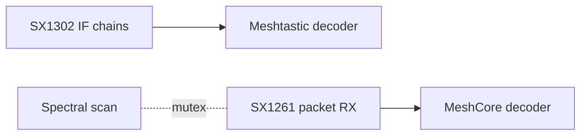

# v0.7.7 release plan (edge): SX1261 native MeshCore RX

**Status:** Planned (after v0.7.6 ships). **Branch:** `feat/v0.7.7-sx1261` from post-v0.7.6 `main`.

**Goal:** Receive MeshCore traffic on the onboard SX1261 companion radio at BW 62.5 kHz without requiring a USB companion for RX.

---

## Why v0.7.7, not v0.7.6

v0.7.6 is Meshtastic mesh-participant work (PKI, ACKs, telemetry, position, traceroute, MQTT TLS). SX1261 packet RX is a separate HAL/capture track with different gates and hardware risk.

---

## Gates (do not start until all are green)

1. **v0.7.6 merged and fleet-validated** on at least one RAK V2.
2. **l34rn3d RAK V2 validation** of `KISS_MeshCore_SX1302` semtech-driver branch (currently WM1302-only).
3. **MeshCore #945 outcome** clarifies BW 62.5 vs BW 125 community direction (affects whether libloragw `BW_62K5` TX patch is required).

---

## Architecture (from Watching entry)

- SX1302 demodulators **cannot** do BW 62.5 RX.
- SX1261 at `/dev/spidev0.1` (already wired on RAK2287 / SenseCap M1) receives 62.5 kHz LoRa packets.
- Today SX1261 is used for spectral scan only (`src/hal/sx1302_spectral_scan.py`); v0.7.7 promotes it to dual spectral-scan + packet RX with mutex discipline.
- Optional libloragw patch for MeshCore TX at 62.5 kHz (same shape as sync-word patch in `install.sh`).

---

## File touch list (estimate)

| File | Change |
|------|--------|
| `src/capture/sx1261_packet_source.py` | New LoRa packet RX driver (IRQ handling per l34rn3d notes) |
| `src/hal/sx1261_radio.py` or extend `sx1302_spectral_scan.py` | Shared SX1261 resource + mutex |
| `src/coordinator.py` | Wire SX1261 source into capture coordinator |
| `src/config.py` | `RadioConfig.sx1261_packet_rx_enabled`, preset selection |
| `scripts/install.sh` | Optional libloragw `BW_62K5` patch block |
| `docs/HARDWARE-MATRIX.md` | USB companion optional for MC RX on supported carriers |
| `tests/test_sx1261_packet_source.py` | Mocked SPI/IRQ path |

---

## Hardware spike (`.141`)

1. Disable spectral scan temporarily; probe SX1261 LoRa RX registers.
2. Confirm MeshCore preset demod without USB companion plugged in.
3. Measure mutex impact on spectral scan cadence.
4. Validate decode path through existing `meshcore_decoder.py`.

Log in `docs/plans/v0.7.7-tests/RESULTS.md` at spike time.

---

## Retire / deprioritize

- `feature/waveshare-sx1262` branch (redundant once SX1261 path works).
- Waveshare HAT remains out of BOM per `project-status.mdc`.

---

## Out of scope

- MeshCore PKI (still USB/companion crypto model).
- Multi-preset IF chain work (Meshtastic side).
- Relay completion.
