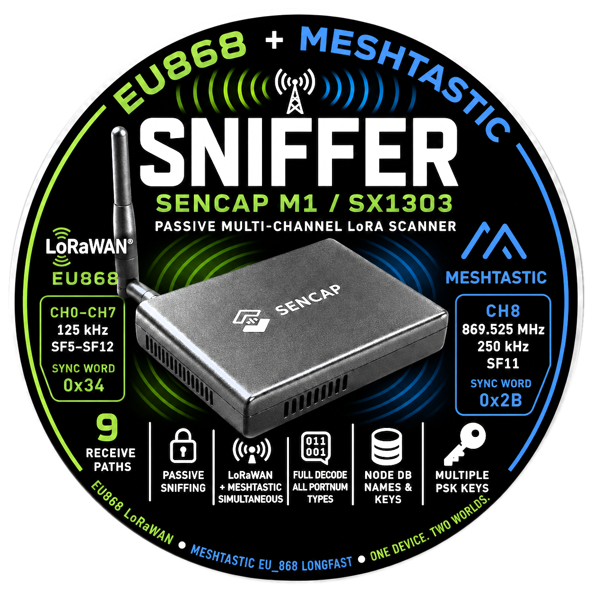

<p align="center">
  
</p>

# EU868 + Meshtastic Sniffer — Sencap M1 / SX1303

Passive multi-channel LoRa scanner running on a Raspberry Pi with a Sencap M1 (SX1303
concentrator) hat. Captures EU868 LoRaWAN traffic and Meshtastic EU_868 LongFast packets
simultaneously across 9 receive paths. Meshtastic packets are automatically decrypted and
fully decoded across all common portnum types.

> **Note:** MeshCore uses BW62.5, which is physically unsupported by the SX1302/1303
> (permanently `#if 0 /* TODO */` in Semtech's own HAL). MeshCore sniffing requires an
> SX1262 companion radio instead.

## Channel plan

The SX1303 runs 8 multi-SF channels and 1 LoRa service channel simultaneously:

| Ch | Frequency | BW | SF | RF chain | Notes |
|----|-----------|----|----|----------|-------|
| 0 | 867.9 MHz | 125 kHz | SF5–SF12 | RF0 | EU868 optional, sub-band L (865–868 MHz, 1%, 25 mW) |
| 1 | 868.1 MHz | 125 kHz | SF5–SF12 | RF0 | EU868 mandatory (1st of 3 required LoRaWAN channels) |
| 2 | 868.3 MHz | 125 kHz | SF5–SF12 | RF0 | EU868 mandatory (2nd of 3 required LoRaWAN channels) |
| 3 | 868.5 MHz | 125 kHz | SF5–SF12 | RF0 | EU868 mandatory (3rd of 3 required LoRaWAN channels) |
| 4 | 869.225 MHz | 125 kHz | SF5–SF12 | RF1 | EU868 sub-band N edge (0.1%, 25 mW) |
| 5 | 869.425 MHz | 125 kHz | SF5–SF12 | RF1 | EU868 sub-band P (10%, 500 mW) |
| 6 | 869.625 MHz | 125 kHz | SF5–SF12 | RF1 | EU868 sub-band P/Q edge |
| 7 | 869.825 MHz | 125 kHz | SF5–SF12 | RF1 | EU868 sub-band Q (1%, 25 mW) |
| 8 | 869.525 MHz | 250 kHz | SF11 | RF1 | **Meshtastic EU_868 LongFast** — sub-band P, also EU868 RX2 default |
| 9 | — | — | — | — | FSK disabled |

RF chain centres: RF0 @ 868.300 MHz, RF1 @ 869.525 MHz.

## Meshtastic EU_868 LongFast

| Parameter | Value |
|-----------|-------|
| Frequency | 869.525 MHz |
| BW | 250 kHz |
| SF | SF11 |
| CR | 4/5 |
| Sync word | 0x2B |

Captured on ch8 (LoRa service channel, RF1 centre, IF offset = 0).

The sniffer sets `lorawan_public=true` in the board config so `lgw_start()` programs sync
word 0x34 (PEAK1=6, PEAK2=8) on the multi-SF demodulators (ch0–ch7). Then `lgw_reg_w()` is
called to override only the service channel (ch8) to 0x2B (PEAK1=4, PEAK2=22) — no HAL
patching required.

## Meshtastic decode

Every received packet is decoded in three stages:

**1. 16-byte plaintext radio header** — dest/src/packet IDs, hop counts, channel hash, flags.

**2. AES-CTR decryption** — all keys in `keys.txt` are tried in order (default public key
first). Key length determines cipher: 16-byte keys use AES-128-CTR, 32-byte keys use
AES-256-CTR. Both are supported transparently.
```
nonce : packet_id[4 LE] | 0x00[4] | src_id[4 LE] | 0x00[4]
key   : D4 F1 BB 3A 20 29 07 59  F0 BC FF AB CF 4E 69 01  (default public, 16 bytes AES-128)
```

**3. Sub-message decode** — the decrypted bytes are a `meshtastic.Data` protobuf. All common
portnum types are fully decoded:

| portnum | Name | Decoded fields |
|---------|------|----------------|
| 1 | TEXT_MESSAGE | raw UTF-8 text |
| 3 | POSITION | lat, lon (sint32 ×1e⁻⁷), altitude (m) |
| 4 | NODEINFO | id, long/short name, hardware model, role, public key (first 8 bytes shown) |
| 5 | ROUTING | error code (0 = ACK) |
| 8 | WAYPOINT | id, name, description, lat/lon, icon |
| 10 | DETECTION_SENSOR | raw UTF-8 alert text |
| 34 | PAXCOUNTER | wifi count, ble count, uptime |
| 65 | STORE_FORWARD | rr type, heartbeat period, message stats |
| 66 | RANGE_TEST | raw UTF-8 text |
| 67 | TELEMETRY | DeviceMetrics / EnvMetrics / LocalStats / PowerMetrics |
| 70 | TRACEROUTE | route nodes with SNR per hop, route_back with SNR |
| 71 | NEIGHBORINFO | list of heard neighbours with SNR |
| 73 | MAP_REPORT | name, hw, firmware, region, preset, lat/lon, online node count |
| 6, 72, 74 | ADMIN, TEXT_COMPRESSED, AUDIO | hex dump |
| 75 | PKI_ENCRYPTED_DM | detected, cannot decrypt (see note below) |
| unknown | — | `[encrypted / wrong key]` |

**Node database** — names and public keys from NodeInfo packets are persisted in `nodes.csv`.
Every subsequent packet header shows the sender's known name, even on the first packet of a
new session before a NodeInfo is heard again.

**Multiple channel PSKs** — `keys.txt` (one base64 PSK per line, `#` for comments) lets the
sniffer try additional private channel keys. The default public key is always tried first.
16-byte base64 keys use AES-128-CTR; 32-byte keys use AES-256-CTR — both work automatically.

**PKI encrypted direct messages** (Meshtastic 2.5+, channel_hash=0, unicast) — use
X25519 ECDH + AES-CCM keyed on the *recipient's* private key. A passive sniffer cannot
decrypt DMs addressed to other nodes regardless of collected public keys.

## Comparison with Meshpoint

[Meshpoint](https://github.com/KMX415/meshpoint) is an open-source Python base station for
the same hardware (RAK7248 / SenseCap M1). Full feature comparison:

| Feature | Meshpoint | sniffer.c |
|---------|-----------|-----------|
| RX — 8 channels simultaneous | Yes | Yes |
| TX — send messages | Yes (up to 27 dBm) | No — receive only |
| Smart relay (hop-preserve) | Yes (experimental) | No |
| AES-128 private channels | Yes | Yes |
| AES-256 private channels | Yes | **Yes** |
| Node database | In-memory | **CSV, persists across restarts** |
| LoRaWAN decode (ch0–ch7) | No | **Yes** |
| MeshCore decode | Yes (USB companion) | No |
| MQTT gateway | Yes (dual-protocol) | No |
| Meshradar cloud map | Yes | No |
| Local web UI + map | Yes | No |
| SQLite packet history | Yes | No |
| Chat / messaging UI | Yes | No |
| GPS positioning | Yes (gpsd) | No |

**Portnum decode — sniffer.c matches or exceeds Meshpoint on every type:**

| portnum | Meshpoint | sniffer.c |
|---------|-----------|-----------|
| 1 TEXT_MESSAGE | text | text |
| 3 POSITION | lat/lon/alt | lat/lon/alt |
| 4 NODEINFO | name, hw, role | name, hw, role, **public key + node DB** |
| 5 ROUTING | error code | error code |
| 8 WAYPOINT | name, desc, lat/lon | id, name, desc, lat/lon, icon |
| 10 DETECTION_SENSOR | text | text |
| 34 PAXCOUNTER | wifi, ble | wifi, ble, **uptime** |
| 65 STORE_FORWARD | rr type | rr type, heartbeat period, msg stats |
| 66 RANGE_TEST | text | text |
| 67 TELEMETRY | DeviceMetrics + EnvMetrics | DeviceMetrics + EnvMetrics + **LocalStats + PowerMetrics** |
| 70 TRACEROUTE | route nodes | route + **SNR per hop** + route_back + **SNR back** |
| 71 NEIGHBORINFO | neighbors + SNR | neighbors + SNR |
| 73 MAP_REPORT | name, hw, lat/lon | name, hw, fw, region, preset, lat/lon, **online count** |
| 75 PKI_ENCRYPTED_DM | not decrypted | not decrypted |

sniffer.c also decodes EU868 LoRaWAN on ch0–ch7. Meshpoint ignores LoRaWAN entirely.

## LoRaWAN decode (ch0–ch7)

LoRaWAN packets on ch0–ch7 use sync word 0x34. The MAC layer header is unencrypted and fully
decoded. FRMPayload is encrypted with per-device session keys (AppSKey) which the sniffer does
not have — its length is shown, contents remain opaque.

| Field | Encrypted? | Shown |
|-------|-----------|-------|
| Message type (Join/Data Up/Down) | No | Yes |
| DevAddr (4 bytes) | No | Yes |
| Frame counter (FCnt) | No | Yes |
| ADR / ACK / FPending flags | No | Yes |
| FOpts length | No | Yes |
| FPort | No | Yes |
| FRMPayload | Yes (AppSKey) | length only |
| MIC | — | shown as hex |
| **Join Request: JoinEUI + DevEUI + DevNonce** | **No** | **Yes — fully in the clear** |
| Join Accept | Yes (AppKey) | `[encrypted — need AppKey]` |

## Sample output

### Text message

```
[14:32:01] 869525000 Hz SF11  RSSI=-87.3 SNR=+2.0  len=41  ← MESHTASTIC
  dest=broadcast   src=a1b2c3d4  id=67452301  hops=3/3  ch=0x08  [Ruud Smeets]
  portnum=1   (TEXT_MESSAGE)
  "Hello from NL!"
```

### Position

```
[14:32:14] 869525000 Hz SF11  RSSI=-89.1 SNR=+1.4  len=43  ← MESHTASTIC
  dest=broadcast   src=a1b2c3d4  id=67452303  hops=3/3  ch=0x08  [Ruud Smeets]
  portnum=3   (POSITION)
  lat=52.370216  lon=4.895168  alt=5m
```

### NodeInfo

```
[14:33:15] 869525000 Hz SF11  RSSI=-92.1 SNR=+0.8  len=58  ← MESHTASTIC
  dest=broadcast   src=a1b2c3d4  id=67452304  hops=3/3  ch=0x08
  portnum=4   (NODEINFO)
  id=!a1b2c3d4  name="Ruud Smeets"  short="RUUD"  hw=Heltec-V3  role=ROUTER  pkey=d4f1bb3a…
```

### Telemetry — device metrics

```
  portnum=67  (TELEMETRY)
  [DeviceMetrics]  battery=82%  voltage=3.91V  chan_util=2.3%  air_util=0.8%  uptime=86400s
```

### Telemetry — environment

```
  portnum=67  (TELEMETRY)
  [EnvMetrics]  temp=21.4C  humidity=58.0%  pressure=1013.2hPa
```

### Telemetry — local stats

```
  portnum=67  (TELEMETRY)
  [LocalStats]  uptime=3600s  chan_util=4.1%  air_util=1.2%  tx=14  rx=87  online=12  total=31
```

### Telemetry — power metrics

```
  portnum=67  (TELEMETRY)
  [PowerMetrics]  ch1=3.71V/142mA  ch2=5.02V/0mA
```

### Routing ACK

```
  dest=b2c3d4e5  src=a1b2c3d4  id=67452307  hops=2/3  ch=0x08  ACK
  portnum=5   (ROUTING)
  error=NONE (ACK)
```

### Traceroute

```
  portnum=70  (TRACEROUTE)
  route: a1b2c3d4(6.3dB) b2c3d4e5(4.8dB) c3d4e5f6
  route_back: c3d4e5f6(5.0dB) b2c3d4e5(3.3dB) a1b2c3d4
```

### NeighborInfo

```
  portnum=71  (NEIGHBORINFO)
  neighbors: b2c3d4e5(8dB) c3d4e5f6(5dB) d4e5f6a7(2dB)  [total=3]
```

### Waypoint

```
  portnum=8   (WAYPOINT)
  id=42  name="Bakkerij"  desc="Open 08:00-18:00"  lat=52.370216  lon=4.895168  icon=0x1f96a
```

### Paxcounter

```
  portnum=34  (PAXCOUNTER)
  wifi=12  ble=7  uptime=3600s
```

### Store and Forward heartbeat

```
  portnum=65  (STORE_FORWARD)
  rr=ROUTER_HEARTBEAT  hb_period=900s  secondary=0
```

### Map Report

```
  portnum=73  (MAP_REPORT)
  name="Ruud Smeets"  short="RUUD"  hw=Heltec-V3  fw=2.5.18  region=11  preset=0  lat=52.370216  lon=4.895168  online=12
```

### EU868 LoRaWAN — Join Request

```
[14:31:44] 868100000 Hz SF9  RSSI=-98.4 SNR=+1.1  len=23
  [LoRaWAN]  Join-Request
  JoinEUI=70-B3-D5-7E-D0-00-01-70  DevEUI=70-B3-D5-49-8E-00-01-A4  DevNonce=0xB200
```

### EU868 LoRaWAN — Unconfirmed Data Up

```
[14:32:03] 868300000 Hz SF7  RSSI=-95.2 SNR=+3.2  len=26
  [LoRaWAN]  Unconfirmed-Data-Up
  DevAddr=78563412  FCnt=1  FPort=2  payload=13B[encrypted]  MIC=AABBCCDD
```

## Files

| File | Purpose |
|------|---------|
| `sniffer.c` | EU868 + Meshtastic passive sniffer — full decode of all portnum types |
| `Makefile` | Builds against `sx1302_hal/libloragw`, links `-lcrypto` |
| `reset_m1.sh` | GPIO reset for M1 — run before starting sniffer |
| `nodes.csv` | Auto-generated node database (NodeInfo: name, hw, public key, last seen) |
| `keys.txt` | Optional: extra channel PSKs to try, one base64 per line |
| `INSTALL.md` | Full setup: SPI, dependencies, build, GPIO wiring, run, troubleshooting |
| `sx1302_hal/` | Semtech official HAL (Lora-net/sx1302_hal, cloned) |
| `meshpoint/` | Reference: open-source Python base station for same hardware (KMX415/meshpoint) |
